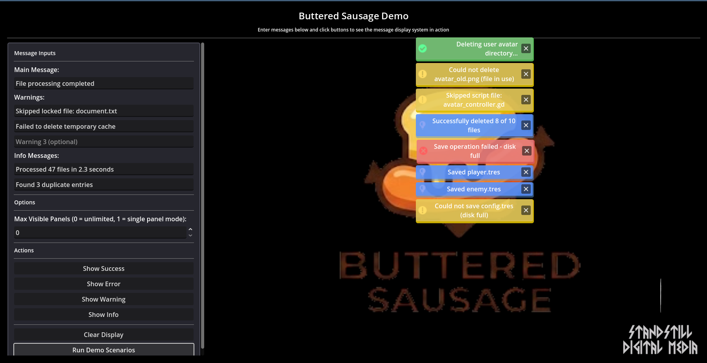
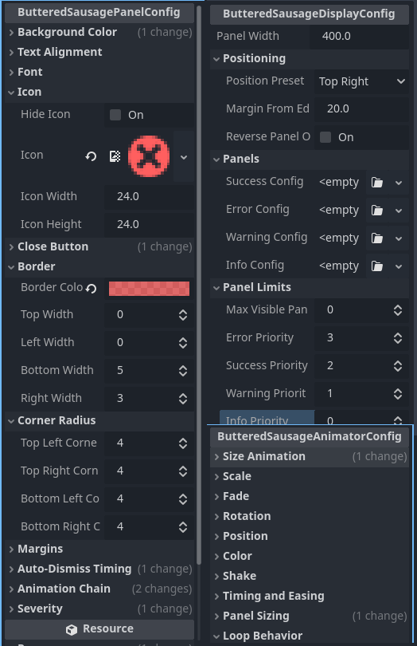

# Buttered Sausage

A visual error/message display system for Godot 4.x with integrated Result pattern for fluent error handling.


### Screenshots


*Multiple severity levels with auto-dismiss and manual close options*


*Fully customizable via inspector-editable Resource files*

## Overview

Buttered Sausage provides a complete solution for displaying operation results and messages in your Godot applications. It combines:

- **Visual Message Display** - Animated panels with severity-based styling (SUCCESS, INFO, WARNING, ERROR)
- **Result Pattern** - Type-safe error handling with builder pattern API for accumulating messages
- **Flexible Animations** - Configurable slide, scale, fade, rotation, and shake effects with animation chains
- **Resource-Based Configuration** - Fully customizable via inspector-editable Resource files
- **Smart Display Modes** - Stack multiple messages or show only the highest priority

Perfect for editor tools, file managers, save systems, validation feedback, and any application that needs robust error reporting with visual polish.

## Features

### Visual Display System
- Color-coded severity levels with smooth animations
- Configurable panel limits (unlimited, single panel, or custom max)
- Auto-dismiss for non-error messages with hover-to-pause
- Manual close buttons
- Animation chains for complex sequences
- Loop animations for persistent effects

### Result Pattern
- Fluent builder API for accumulating warnings and info messages
- State conversion (success → failure, etc.) while preserving details
- Merge results from nested operations
- Consistent return pattern for functions with data payload
- Type-safe with full autocomplete support
- Standalone - can be used without the UI/display components

### Animation System
- Animation chains - sequential series of effects
- **Transform animations work together:** Rotation, Scale, and Position can all animate simultaneously
- Multiple simultaneous effects: slide, scale, fade, rotation, color, position
- Shake effect for emphasis
- Configurable pivot points for rotation and scale
- Full control over timing, easing, and transitions
- Support for looping animations
- Standalone animator (`ButteredSausageAnimator` + `ButteredSausageAnimatorConfig`) can be used to animate any Control node
- **Note:** Size animation cannot be combined with transform animations (see KNOWN_ISSUES.md)

### Configuration System
- **ButteredSausageDisplayConfig** - Display positioning, panel width, and per-severity configurations
- **ButteredSausagePanelConfig** - Colors, fonts, icons, borders, timing, and animation chains
- **ButteredSausageAnimatorConfig** - Individual animation effects with full customization
- All configurations are Resources editable in the Inspector

## Why "Buttered Sausage"?

All classes use the `ButteredSausage` prefix to avoid naming conflicts with other addons. GDScript doesn't have namespaces, so this ensures type safety and autocomplete work reliably:

```gdscript
@export var display: ButteredSausageDisplay
var result := ButteredSausage.success("Operation completed!")
```

**About the name:** I asked my wife, Liz, to help name a "result and toast addon." She was probably thinking about breakfast when she blurted out "Buttered Sausage." We looked at each other and just started giggling. The name stuck. It's silly, memorable, and avoids namespace collisions. That's it - just harmless fun, not meant to be anything else.

## Installation

### Via Asset Library (Recommended)
1. Open Godot Editor
2. Go to **AssetLib** tab
3. Search for "Buttered Sausage"
4. Click **Download** → **Install**

### Manual Installation
1. Download the latest release
2. Copy the `addons/ButteredSausage/` folder to your project's `addons/` directory

## Quick Start

### Basic Usage

Add a `ButteredSausageDisplay` node to your scene:

```gdscript
extends Control

@onready var error_display: ButteredSausageDisplay = $ErrorDisplay

func _ready() -> void:
	# Show a simple success message
	error_display.show_success("File saved successfully!")

	# Show an error that requires dismissal
	error_display.show_error("Failed to load configuration file")

	# Show a warning with auto-dismiss
	error_display.show_warning("Network connection unstable")
```

### Using the Result Pattern

The Result pattern (`ButteredSausage` class + `ButteredSausageSeverity` enum) can be used standalone without the display system or integrated with visual feedback.

**Dependencies:** Only requires `ButteredSausage` and `ButteredSausageSeverity` - no UI components needed.

**Standalone Usage:**
```gdscript
func process_data() -> ButteredSausage:
	var result := ButteredSausage.success("Processing complete")

	if some_warning:
		result.with_warning("Minor issue detected")

	if critical_error:
		result.to_failure("Failed to process")

	return result

# Check result without displaying
func _ready() -> void:
	var result := process_data()
	if result.is_success():
		print("Success: ", result.message)
	else:
		print("Failed: ", result.message)
```

**Integrated with Display:**

```gdscript
func save_file(path: String) -> ButteredSausage:
	var result := ButteredSausage.success("File saved successfully")

	# Accumulate warnings during operation
	if not has_write_permission(path):
		result.with_warning("Limited write permissions")

	if file_exists(path):
		result.with_info("Overwrote existing file")

	# Convert to failure if something critical happens
	if disk_full():
		result.to_failure("Save failed - disk full")

	return result

func _on_save_pressed() -> void:
	var result := save_file("user://config.dat")
	error_display.populate_from_result(result)
```

### Builder Pattern Examples

**Accumulator Pattern** - Build up messages as you go:
```gdscript
var result := ButteredSausage.success("Batch operation completed")
result.with_info("Processed 47 files")
result.with_warning("Skipped 2 locked files")
result.with_warning("Failed to delete temporary cache")
error_display.populate_from_result(result)
```

**State Conversion** - Change success to failure while keeping details:
```gdscript
var result := ButteredSausage.success("Processing files...")
result.with_info("Loaded config.json")
result.with_info("Validated 15 entries")

if critical_error_occurred():
	result.to_failure("Process halted due to critical error")

error_display.populate_from_result(result)
```

**Merge Pattern** - Combine results from nested operations:
```gdscript
var parent_result := ButteredSausage.success("Batch operation in progress")

# Sub-operation 1
var child1 := process_first_batch()
parent_result.merge_from(child1)

# Sub-operation 2
var child2 := process_second_batch()
parent_result.merge_from(child2)

error_display.populate_from_result(parent_result)
```

## Important Notes

### Message Deduplication

Buttered Sausage prevents duplicate messages from spamming the display. When creating a message, it checks all existing panels and won't create a new one if an identical message already exists (based on exact string comparison).

**Warning:** Avoid using dynamic strings that change with each call:

```gdscript
# BAD - Creates a new panel every time because the string is different
error_display.show_error("The name: " + name_input.text + " is invalid")

# GOOD - Uses a static message, won't create duplicates
error_display.show_error("Invalid name format")
```

This is especially important when validating text input in real-time (e.g., listening to `text_changed` signals). Use generic, static messages to avoid panel spam.

## Configuration

### Best Practices for Custom Configurations

**IMPORTANT:** To preserve your custom configurations when upgrading Buttered Sausage, follow these best practices:

1. **Create your own resource files OUTSIDE the addon folder:**
   - Create a folder in your project: `res://config/buttered_sausage/`
   - Copy the default `.tres` files from `res://addons/ButteredSausage/config/resource/` to your project folder
   - Modify your copies, not the originals in the addon folder

2. **Reference your custom resources in your scenes:**
   - Select your `ButteredSausageDisplay` node
   - In the Inspector, click the `display_config` property
   - Select "Load" and choose your custom config from `res://config/buttered_sausage/`

3. **Treat addon files as read-only:**
   - The files in `addons/ButteredSausage/` are templates and will be overwritten during upgrades
   - Your custom configs outside the addon folder will be preserved

**Why this matters:** When you upgrade to a new version by extracting the addon over the old one, all files in `addons/ButteredSausage/` are replaced. Any modifications you made to files inside the addon folder will be lost.

### Upgrading from 1.0.0 to 1.0.1

If you modified the default resource files in `addons/ButteredSausage/config/resource/` during 1.0.0:

1. **Before upgrading:** Copy your modified `.tres` files to a safe location outside the addon folder
2. **Upgrade:** Extract 1.0.1 over your existing installation
3. **After upgrading:** Your custom `.tres` files outside the addon are safe. If you modified files inside the addon, re-apply your changes by:
   - Opening your saved copies
   - Comparing them to the new defaults
   - Recreating your custom configs in your project folder (not in the addon folder)

**What changed in 1.0.1:**
- Added comprehensive Inspector tooltips (hover over any property for detailed help)
- Fixed resource caching issues
- Fixed color animation styling preservation
- Fixed font color/size configuration
- No breaking API changes - existing scenes and scripts work without modification

### Display Setup

The `ButteredSausageDisplay` node comes pre-configured with all necessary resources. To customize the display, open `res://addons/ButteredSausage/config/resource/display/display_config.tres` in the Inspector. This file contains a `ButteredSausageDisplayConfig` resource with sensible defaults and references to all severity-specific panel configurations.

**ButteredSausageDisplayConfig** properties:
- `panel_width` - Width of all message panels (default: 400)
- `position_preset` - Screen position (TOP_RIGHT, BOTTOM_LEFT, etc.)
- `margin_from_edge` - Distance from screen edges (default: 20)
- `reverse_panel_order` - New panels appear at bottom instead of top
- `max_visible_panels` - Maximum number of visible panels (0 = unlimited)
- `error_priority`, `success_priority`, `warning_priority`, `info_priority` - Priority values for single panel mode (higher = higher priority)
- `success_config`, `error_config`, `warning_config`, `info_config` - Per-severity panel configurations

### Panel Limits

The `max_visible_panels` setting controls how many panels can be displayed simultaneously:

**Unlimited Mode** (default) - Show all messages:
```gdscript
# In Inspector: set display_config.max_visible_panels = 0
```

**Single Panel Mode** - Show only the highest priority message:
```gdscript
# In Inspector: set display_config.max_visible_panels = 1
# Uses priority values from display_config (default: ERROR=3, SUCCESS=2, WARNING=1, INFO=0)
# In case of tie, most recent message wins
```

**Limited Mode** - Show up to N messages:
```gdscript
# In Inspector: set display_config.max_visible_panels = 5
# When limit is reached, oldest panels are automatically dismissed (FIFO)
```

### Panel Configuration

Each severity level has its own pre-configured `ButteredSausagePanelConfig` resource (found in `res://addons/ButteredSausage/config/resource/panels/`) with extensive customization options. Open these .tres files in the Inspector to customize:

**Visual Styling:**
- `background_color` - Panel background color
- `border_color`, `top_width`, `left_width`, `bottom_width`, `right_width` - Border styling
- `top_left_corner_radius`, etc. - Corner radius for each corner
- `font`, `font_color`, `font_size` - Text styling
- `label_text_alignment` - Text alignment (Left, Center, Right, Justify)

**Icons and Buttons:**
- `icon`, `icon_width`, `icon_height` - Severity icon
- `hide_icon` - Hide the severity icon
- `close_button_icon`, `close_button_width`, `close_button_height` - Close button styling
- `hide_close_button` - Hide the close button

**Timing:**
- `auto_dismiss` - Enable automatic dismissal
- `duration` - Seconds before auto-dismiss (default: 3.0 for success)
- **Hover-to-Pause:** Auto-dismiss timers automatically pause when the user hovers their mouse over a panel, allowing them time to read longer messages. The timer resumes when the mouse exits the panel.

**Animation Chains:**
- `animation_chain` - Array of `ButteredSausageAnimatorConfig` for opening animations
- `close_animation_chain` - Array of `ButteredSausageAnimatorConfig` for custom closing animations
- `close_behavior` - Default closing behavior when `close_animation_chain` is empty:
  - `REVERSE_FIRST_ANIMATION` (default) - Reverses the first animation from `animation_chain`
  - `MIRROR_FULL_CHAIN` - Reverses entire `animation_chain` in reverse order
  - `NO_ANIMATION` - Hides immediately without animation

### Animation Configuration

Unlike the display and panel configurations (which are pre-created), you'll create your own `ButteredSausageAnimatorConfig` resources for custom animations. To create one:

1. Right-click in the FileSystem panel → **New Resource**
2. Select **Resource** (empty resource)
3. Save it with a descriptive name (e.g., `slide_fade_in.tres`)
4. In the Inspector, click the **Script** property and select `res://addons/ButteredSausage/config/scripts/animator_config.gd`
5. Configure the animation properties

Each config can enable multiple effects simultaneously:

**Size Animation:**
- `animate_size` - Enable size animation (slide effect)
- `axis` - VERTICAL or HORIZONTAL
- `open_direction` - POSITIVE (down/right) or NEGATIVE (up/left)

**Scale Animation:**
- `animate_scale` - Enable scale effect
- `scale_from` - Starting scale (e.g., Vector2(0.9, 0.9))
- `scale_to` - Ending scale (e.g., Vector2.ONE)
- `scale_pivot_preset` - Pivot point for scaling (CENTER, TOP_LEFT, BOTTOM_RIGHT, etc.)
- `scale_pivot_custom` - Custom pivot point if using CUSTOM preset
- **Note:** If both scale and rotation animations are enabled, the rotation pivot takes precedence since rotation is typically more sensitive to pivot placement.

**Fade Animation:**
- `animate_fade` - Enable fade effect
- `fade_from` - Starting alpha (0.0 = invisible)
- `fade_to` - Ending alpha (1.0 = opaque)

**Rotation Animation:**
- `animate_rotation` - Enable rotation effect
- `rotation_from_degrees`, `rotation_to_degrees` - Rotation angles
- `rotation_orbit` - True for orbital rotation, false for spinning in place
- `rotation_pivot_preset` - Pivot point (CENTER, TOP_LEFT, BOTTOM_RIGHT, etc.)
- `rotation_pivot_custom` - Custom pivot point if using CUSTOM preset
- ⚠️ **Note:** Rotation works perfectly with Scale and Position. However, Size animation cannot be combined with transform animations. See [KNOWN_ISSUES.md](KNOWN_ISSUES.md) for details.

**Position Animation:**
- `animate_position` - Enable position offset effect
- `position_offset` - Starting position offset (animates to Vector2.ZERO)

**Color Animation:**
- `animate_color` - Enable color tween effect
- `color_from` - Starting color
- `color_to` - Ending color

**Shake Animation:**
- `animate_shake` - Enable shake effect (ignores other animations)
- `shake_amount` - Horizontal shake distance
- `shake_speed` - Speed of each shake oscillation

**Timing and Easing:**
- `transition_type` - Tween transition (TRANS_CUBIC, TRANS_SINE, etc.)
- `ease_type_open` - Easing for opening (EASE_OUT, EASE_IN_OUT, etc.)
- `ease_type_close` - Easing for closing (EASE_IN, EASE_IN_OUT, etc.)
- `animation_speed` - Duration in seconds

**Loop Behavior:**
- `loop_animation` - Loop this animation after chain completes

### Animation Chains

Animation chains allow you to create complex sequential animations. Each config in the chain plays one after another:

```
Example chain:
1. Slide down + fade in (0.3 seconds)
2. Scale bounce effect (0.2 seconds)
3. Subtle shake for emphasis (0.4 seconds)
```

After creating your animation configs, add them to the `animation_chain` array in your `ButteredSausagePanelConfig` (found in `res://addons/ButteredSausage/config/resource/panels/`). The display will:
1. Play each animation sequentially
2. If any animation has `loop_animation = true`, continuously loop those animations
3. Stop looping when the panel closes

For closing animations, you have multiple options:
1. **Custom close chain** - Define a `close_animation_chain` with specific closing animations (takes precedence)
2. **Default behavior** - When `close_animation_chain` is empty, use the `close_behavior` setting:
   - `REVERSE_FIRST_ANIMATION` - Reverses only the first animation (default, fastest)
   - `MIRROR_FULL_CHAIN` - Reverses entire opening chain in reverse order (mirrors open)
   - `NO_ANIMATION` - Hides immediately without animation (instant dismiss)

## API Reference

### Standalone Components

These components can be used independently without the full display system:

**ButteredSausageSeverity** - Severity level enum
- **Dependencies:** None
- **Usage:** Define message severity levels
- **Levels:** `SUCCESS`, `INFO`, `WARNING`, `ERROR`

**ButteredSausage** - Result pattern class
- **Dependencies:** `ButteredSausageSeverity`
- **Usage:** Encapsulate operation results with messages, errors, data payload and accumulated details

**ButteredSausageAnimator** - Control animation system
- **Dependencies:** `ButteredSausageAnimatorConfig`
- **Usage:** Animate any Control node with slides, scales, fades, rotations, colors, and positions

### Full Display System

**ButteredSausageDisplay**

**Main Methods:**
- `show_success(message: String)` - Display success message (auto-dismiss)
- `show_warning(message: String)` - Display warning message (auto-dismiss)
- `show_info(message: String)` - Display info message (auto-dismiss)
- `show_error(message: String)` - Display error message (manual dismiss)
- `populate_from_result(result: ButteredSausage)` - Display all messages from a Result object
- `clear_all_panels()` - Close all message panels

**ButteredSausage (Result Class)**

**Factory Methods:**
- `ButteredSausage.success(msg: String, data: Variant = null)` - Create success result
- `ButteredSausage.failure(msg: String, data: Variant = null, error: Error = FAILED)` - Create failure result
- `ButteredSausage.warning(msg: String, data: Variant = null)` - Create warning result
- `ButteredSausage.info(msg: String, data: Variant = null)` - Create info result

**Builder Methods:**
- `with_detail(msg: String, severity: Severity)` - Add detail message
- `with_warning(msg: String)` - Add warning detail
- `with_info(msg: String)` - Add info detail
- `with_error(msg: String, err: Error = FAILED)` - Add error detail

**State Conversion:**
- `to_success(msg: String = "")` - Convert to success
- `to_failure(msg: String = "", err: Error = FAILED)` - Convert to failure
- `to_warning(msg: String = "")` - Convert to warning
- `to_info(msg: String = "")` - Convert to info

**Utility Methods:**
- `merge_from(other: ButteredSausage, takeover_message: bool = true)` - Merge another result
- `has_details() -> bool` - Check if result has detail messages
- `is_success() -> bool` - Check if result represents success

## Examples

See the included demo scene at `addons/ButteredSausage/demo/buttered_sausage_demo.tscn` for interactive examples including:
- Basic message display
- Result pattern usage
- Accumulator pattern
- State conversion
- Merge pattern
- Validation with multiple errors
- Various animation configurations

## Known Issues

**Size Animation Limitation:** Size animation cannot be combined with transform animations (Rotation, Scale, Position) in the same AnimatorConfig. See [KNOWN_ISSUES.md](KNOWN_ISSUES.md) for technical details.

**Good news:** Rotation, Scale, and Position all work together perfectly! You can combine all three for complex transform effects.

## Part of the AWOC Ecosystem

This addon was developed as part of [AWOC (Avatar Wardrobe Organizer and Colorer)](https://github.com/standstilldigitalmedia/AWOC), a comprehensive avatar customization system for Godot. Check out AWOC if you need:
- Advanced avatar customization
- Wardrobe management
- Color overlay system with material management
- Modular character systems

## License

CC0 1.0 Universal (Public Domain Dedication) - See LICENSE file for details

This means you can do whatever you want with this software. No attribution required, no restrictions, no copyright.

## Credits

Developed by [Standstill Digital Media](https://github.com/standstilldigitalmedia/)

## Contributing

We welcome contributions! See [CONTRIBUTING.md](CONTRIBUTING.md) for guidelines.

## Support

Report bugs via [Github Issues](https://github.com/standstilldigitalmedia/buttered-sausage/issues)

Ask questions in [Github Discussions](https://github.com/standstilldigitalmedia/buttered-sausage/discussions)
